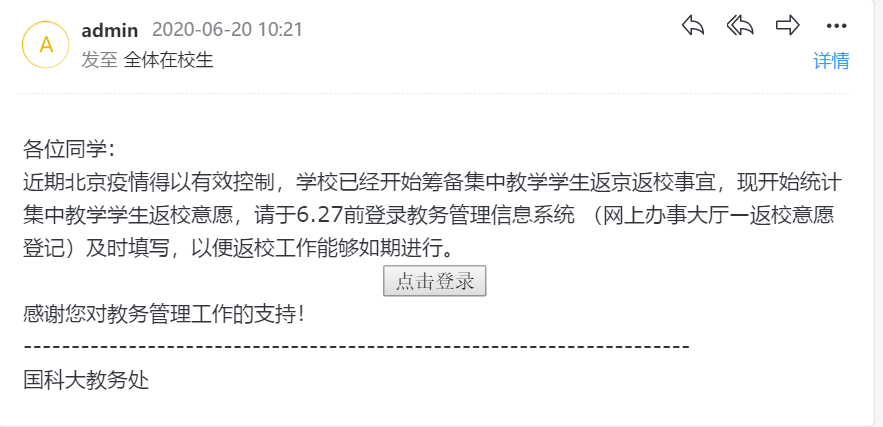
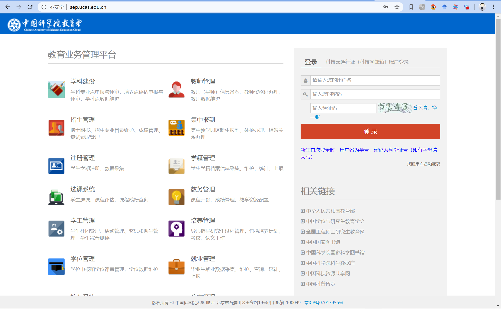
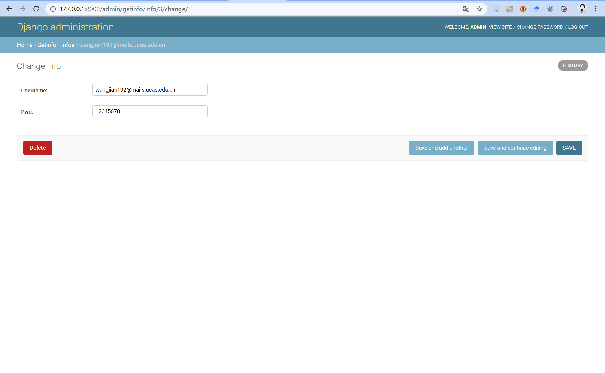
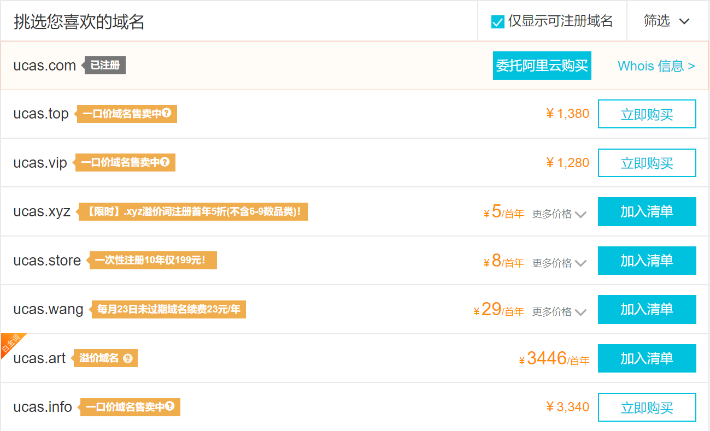

# 1 简介

一次小作业，觉得很有趣

场景分析部分就隐藏了，因为会泄露一些信息

# 2 道具

主要内容如下：

1. 邮件内容
2. 发送邮件的脚本
4. 钓鱼攻击所用的木马或者钓鱼网站

# 3 邮件

## 3.1 发送脚本

代码 : send.py

运行要求: python3

由于没有能够提供邮件服务器，所以这里使用了qq邮箱提供的smtp服务；

收件人应该遍历尽可能多的常见的姓名拼音组合，由于没有适当的数据集，代码中只给出了示例；

## 3.2邮件内容

代码 : mail.html

邮件由一个html文件构成，收到的邮件如下：



点击登录后会跳转到预设好的钓鱼页面！

# 4 站点设计

代码 : diaoyu/

运行要求 : django2.2  

```shell
python manage.py runserver
```


首先是完全模仿的国科大教务系统首页，如图：


可以看出，和正常的页面并无差别，诱导用户输入账户密码和验证码，点击登录，随即发生两件事:

1. 跳转到正确的教务网站页面，这样用户就会以为是刚才出了bug而意识不到账户密码的失窃（毕竟我校系统日常bug）

   

2. 将账户密码存储至数据库，登录管理员后台页面即可查看窃取的账户密码

   

# 5 不足

1. 未能有效地伪装域名，对域名有基本认识的同学容易识破，但据我调研，还有一些ucas的域名尚未注册，学校网络中心是否应该考虑下都买下来，避免风险

   

2. 现代浏览器往往有记忆账户密码功能，被攻击者发现需要输入账户密码可能会感到异常进而察觉